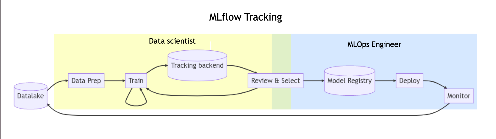
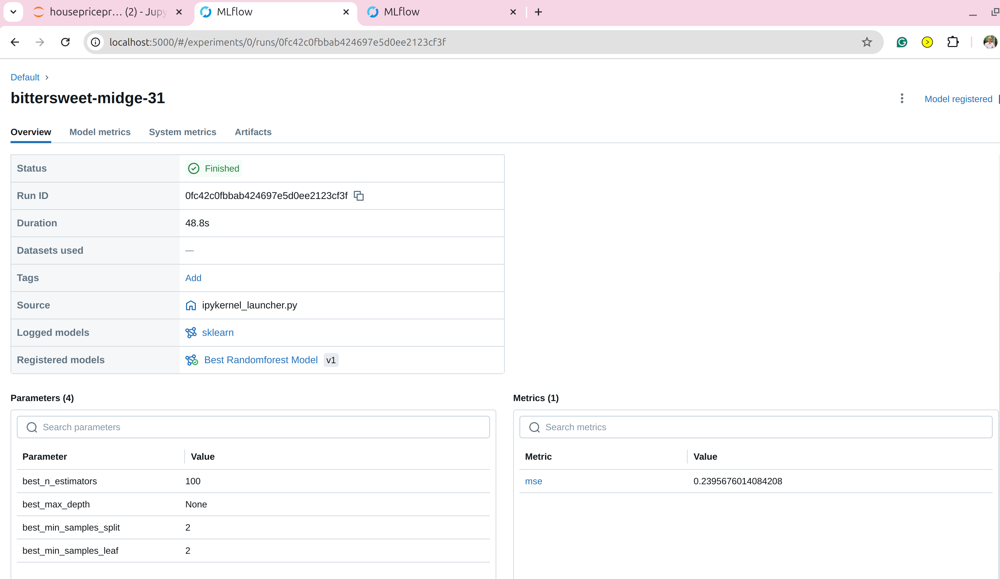

# **MLflow Getting Started with Jupyter Notebook**



This project provides a hands-on guide to using **MLflow** for experiment tracking, model logging, and deployment. It is set up to run inside Docker containers, with **Jupyter Notebook** for experimentation and MLflow for tracking and managing machine learning workflows.

---

## **Features**
- MLflow server for experiment tracking and model registry.
- Jupyter Notebook for developing and testing ML models.
- Dockerized environment for consistent and portable execution.

---

## **Prerequisites**
Before running the project, ensure you have the following installed:
1. **Docker**: [Install Docker](https://docs.docker.com/get-docker/)
2. **Docker Compose**: [Install Docker Compose](https://docs.docker.com/compose/install/)

---

## **Setup Instructions**
1. Clone this repository:
   ```bash
   git clone <repository-url>
   cd mlflow_starter

## **Build the Docker Containers**
```bash

docker compose build
docker compose up -d
